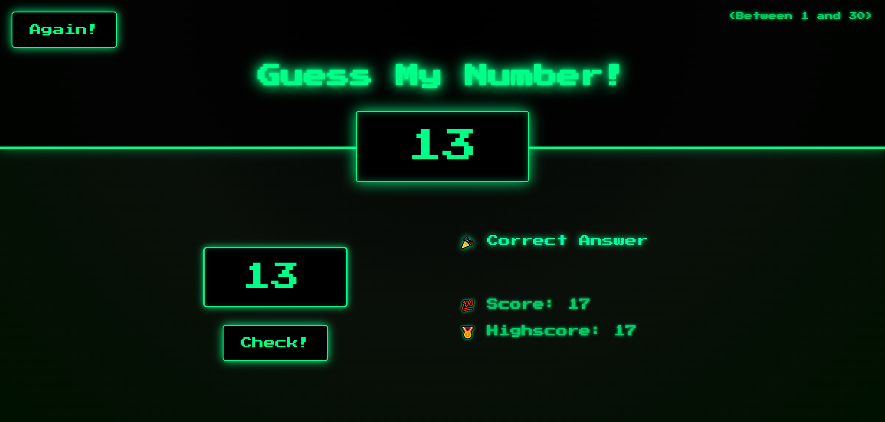
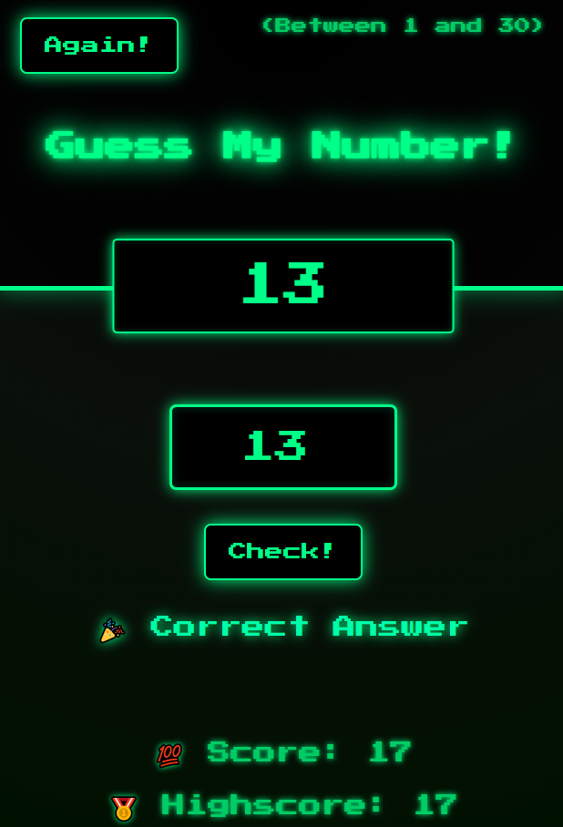

# 🎮 Guess My Number Game | Retro Neon Game

**Guess My Number** is a retro-styled, neon-themed web game where players try to guess a **secret number** between 1 and 30.  
Built with **HTML, CSS, and JavaScript**, it features animated glowing effects, responsive design, and live score tracking.

---

## 🎨 Features

- ❓ Input a number and check if it's correct
- 🎯 Feedback for guesses: Too high, Too low, or Correct
- 🏆 Tracks score and highscore dynamically
- 🔄 Reset the game with the **Again!** button
- 🌈 Neon retro styling with animations and glowing text
- 📱 Fully responsive design for desktop, tablet, and mobile

---

## 🕹️ How to Play

1. Enter a number between **1 and 30** in the input box.
2. Click the **Check!** button to submit your guess.
3. The game will tell you if your guess is **too high**, **too low**, or **correct**.
4. Your **score decreases by 1** for every wrong guess.
5. Try to guess the number with as few attempts as possible to maximize your **score**.
6. Click **Again!** to reset the game and play another round.

---

## 🛠️ Built With

| Technology      | Purpose                                 |
| --------------- | --------------------------------------- |
| 🧱 HTML5        | Page structure                          |
| 🎨 CSS3         | Neon styling, layout, responsive design |
| ✨ JavaScript   | Game logic, interactivity               |
| 🔤 Google Fonts | Press Start 2P retro font               |

---

## 📸 Screenshots

  

---

## 🌐 Live Demo

🔗 **GitHub Pages:**  
[https://gaurav-j-lad.github.io/Guess-My-Number-Game](https://gaurav-j-lad.github.io/Guess-My-Number-Game)

---

## 📧 Let's Connect

🔗 **LinkedIn:**  
[https://www.linkedin.com/in/gaurav-lad1974](https://www.linkedin.com/in/gaurav-lad1974)

📨 **Email:**  
gauravlad1974@gmail.com
